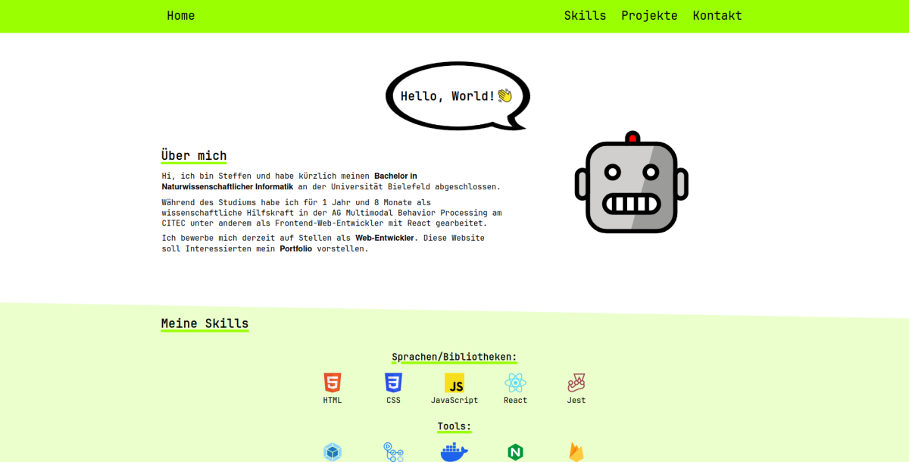

# Personal website project

This is my personal Website project which I use to display my portfolio. It's written in plain HTML, CSS and Javascript. The website is responsive and works for desktop and mobile.

## Features

- At the moment it simply displays some static content
- Responsive for desktop and mobile

## Planned Features

- Add i18n (internationalization)

## How to run

The website can be run with npm scripts from the project root directory. The scripts execute Webpack or Webpack DevServer for bundling and development. See `package.json` for details.

### Prerequisites
Node.js and npm (Node Package Manager) have to be installed (I used Node.js 20).

For Windows or Mac visit https://nodejs.org/en and follow the instructions.

For Linux you can use nvm (Node Version Manager, https://github.com/nvm-sh/nvm) to install and manage Node and npm versions.

When using the project for the first time you have to run `npm install` from the project root directory to install dependencies which are defined in the package.json.

### Scripts

For development execute:

    npm run dev

To build the website for production execute:

    npm run build

## Code
It's mostly HTML and CSS. There's some JavaScript for the mobile dropdown menu and to generate contact details for obfuscation against email crawlers.

All the content is located in `index.html` and the styling is located in `index.css`. `data-privacy.html` is also styled by `index.css`.

## Tools

Webpack 5 is used for processing the source code and the assets (See `webpack.config.js`). It uses Babel for transpiling the JS. The output directory is `dist`. HTMLWebpackPlugin generates the output HTML files based on the HTML templates in `src` and injects the corresponding bundled JS files. Images and fonts are processed with Webpack 5 Asset Modules. CSS is processed with css-loader and style-loader plugins.

## Support

If you are having issues, please let me know via the contacts on my website.

## License

The project is licensed under the ISC license.